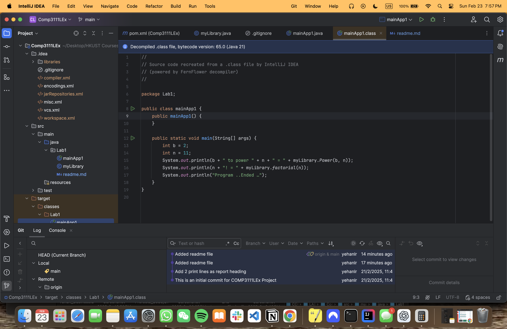

# COMP3111 Lab 1
This is my lab project for COMP3111.

RANASINGHE, Yehan Lakvindu : 
20900127

## Features
- Implements a simple Java application.
- Uses Maven for project management.

## How to Run
1. Clone the repository.
2. Open the project in IntelliJ IDEA.
3. Run `mainApp1.java` or `myLibrary.java`.

## Screenshot

